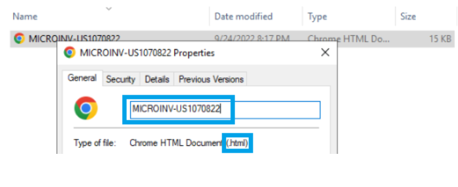
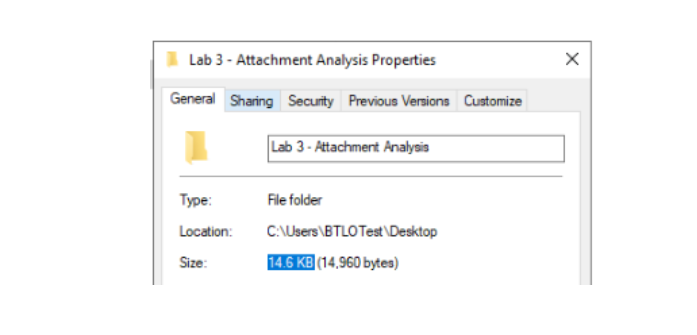
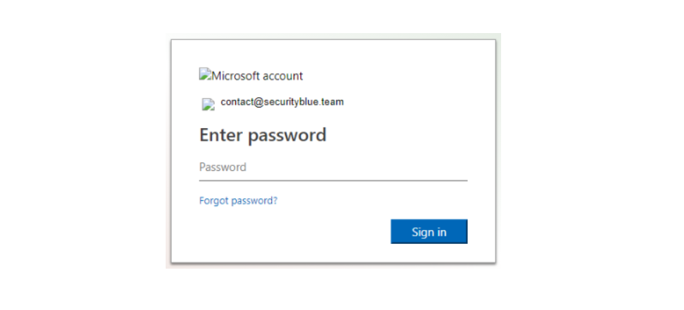
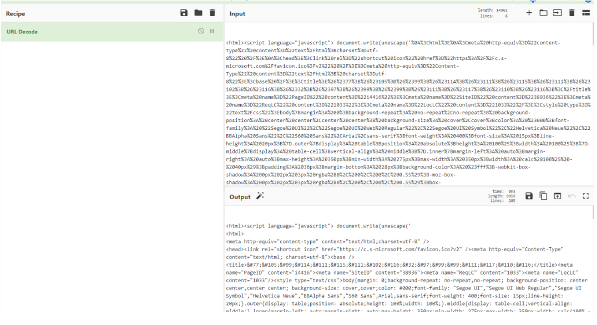
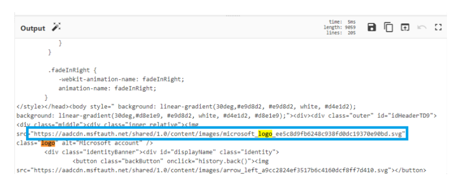

# Investigating an Attachment Lab

Dans ce lab, j'ai analysé un fichier HTML malveillant attaché à un email de phishing.

---

## Question 1 — Nom du fichier

---

## Question 2 — SHA256 Hash

---

## Question 3 — Taille du fichier (KB)

---

## Question 4 — Quelle compagnie est imitée ?

Le fichier imite la page de connexion Microsoft Outlook / Office365.

---

## Question 5 — Quelle victime est ciblée ?

---

## Question 6 — Nom du logo Microsoft trouvé dans le code source

Pour trouver ça j'ai copié le code source dans CyberChef, appliqué URL Decode, puis cherché "logo" avec CTRL+F.

---

## Question 7 — URL utilisée pour envoyer les credentials au serveur

En ouvrant les Developer Tools sur l'onglet Network et en entrant un faux mot de passe, on peut voir l'URL complète avec l'email et le mot de passe dedans — c'est comme ça que l'attaquant récupère les infos.

---

## Outils utilisés

- PowerShell (Get-FileHash)
- Google Chrome (View Source + Developer Tools)
- CyberChef (URL Decode)

---

## Ce que j'ai appris

- Hasher un fichier suspect avec PowerShell
- Analyser le code source d'une fausse page de login
- Utiliser CyberChef pour décoder du contenu URL encodé
- Voir comment les credentials sont volés via une requête réseau
